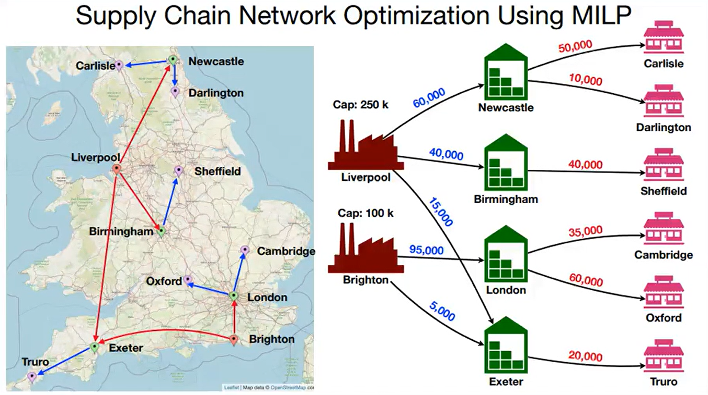

# 🏭 Supply Chain Network Optimization Using MILP

## 📖 Overview
This project tackles complex logistics and supply chain challenges using mathematical modeling and Mixed Integer Linear Programming (MILP). Developed in RStudio, the project walks through the complete formulation of a supply chain network. By setting up an objective function and applying rigorous real-world constraints - ranging from production limits to customer demand - the model successfully calculates the most cost-effective routing strategy.

## 🎯 Objective
The primary objective is to optimize a supply chain distribution network to minimize overall operational and transportation costs. By translating business requirements into mathematical constraints and running an MILP optimizer, the project aims to define the exact optimal flow of goods from factories, through intermediate distribution centers, directly to the final customer locations.

## 🛠️ Tech Stack & Tools
* **Language:** R
* **Environment:** RStudio
* **Optimization:** Mixed Integer Linear Programming (MILP)

## 🧠 Key Learnings & Skills Demonstrated
* **Problem Formulation:** Translating business logistics problems into a mathematical objective function.
* **Capacity Constraints:** Implementing limits on factory production capacities to reflect realistic manufacturing conditions.
* **Flow Constraints:** Modeling the inflow and outflow of goods at intermediate distribution centers to maintain supply chain continuity.
* **Demand Constraints:** Ensuring all final customer locations receive their exact required quantities without shortages.
* **Execution & Analysis:** Running the optimizer in RStudio to obtain the solution and analyzing the final variables to evaluate efficiency.

## 🗺️ Final Optimized Route

The map above visualizes the model's final solution, illustrating the optimal paths chosen by the MILP solver to efficiently distribute goods across the entire network while strictly adhering to all capacity and demand constraints.

## 🚀 Getting Started

### 📋 Prerequisites
To run this project, you will need:
* R installed on your machine
* RStudio

### ⚙️ Installation & Setup

1. Clone the repository to your local machine:
   git clone https://github.com/Raaaj2005/Supply-Chain-Network-Optimization-Using-MILP.git

2. Navigate into the downloaded project folder:
   cd Supply-Chain-Network-Optimization-Using-MILP

3. Launch RStudio and open the project's R script.

4. Install any required optimization packages (e.g., `lpSolve` or `ompr`) as prompted in the script.

5. Execute the code blocks sequentially to formulate the problem, apply the constraints, and run the optimizer.

## 👤 Author
Name: Raj Fatehveer Singh Brar 
Email ID: rbrar_be23@thapar.edu 
University: Thapar Institute of Engineering and Technology
